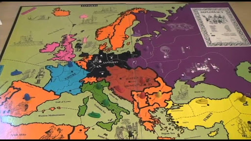
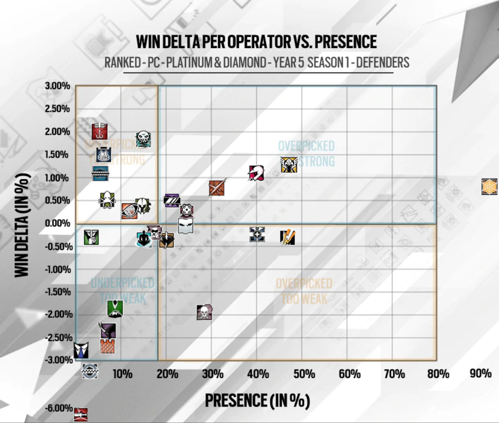

Say you and I are flipping a coin, heads you win tails I win. This is a symmetric game. If you and I are playing a 2d fighting game, you as a big robot, me as a half-tiger person, each with different moves available to us, then clearly the game is asymmetric. 

{:class="img-responsive"}
*Tekken 7, PS4, XboxOne, PC, Arcade. 2015.*

Many traditional board games are symmetric, consider Chess or Draughts. All players have access to the same materials, can find themselves in the same state and have the same actions available to them from those states. A symmetric game where players act simultaneously is balanced by default. With a turn-based game you have to overcome **first-move bias**. 

### Chess, board game. *~500 AD, Hán Xin*

Give me a moment to talk about Chess. In Chess, White goes first and, according to many professional players and Chess theorists, has an advantage. Indeed White wins more often than Black historically (the records available date back to 1851). Thrillingly, a large proportion of Chess matches at the highest level end in draws, but I'm a football fan, so I suppose I'm desensitised to that. White wins roughly 40% of games, whereas Black wins about 30%. 

But not all players believe White's advantage to be so strong. A 19$^{th}$ century German Chess article described the phonetically beautiful concept of *"Zugzwang"*, the compulsion to move. The use of the term has changed over the last century and a bit, but is often used to describe a position from which neither player benefits from making a move, therefore whoever's turn it is, is at a disadvantage. Scottish Chess player and Philosopher (naturally) Jonathan Rowson introduced the term *"Zugzwang Lite"* to describe a situation where both players want to react to their opponents move and in this instance White's *extra* move is infact a burden.

~~

Tekken isn't asymmetric of course, I chose it as an example earlier so I could use pictures of King (the Tiger-headed man on the right of the image above). Matches in Tekken are preceeded by **Character Selection**. Here players choose one, or several members from the cast of available fighters, often choosing distinct material from a shared pool. So even if King is more likely to beat Jack (the robot-looking man on the left), the game is balanced because either player could choose them. So that's it then? Symmetric games are balanced, asymmetric games can include material selection beforehand from a shared pool to become symmetric, therefore all games can be balanced. Job Done. Let's all just pack up and leave.

Except that's a view that is empathetic to the players, but not the game material itself. What about poor old Jack doomed to lose to King more often than not? Letting down whatever poor idiot had the misfortune of choosing him? No I want to ensure about balance **between material**.

I'll write about how I think that can be done another time, for now I want to talk about some games which use their assymetry as a feature, and the attempts to balance the game regardless.

### Diplomacy, board game. *1959*, Allan Calhamer

Diplomacy takes seven players (don't be fooled into trying to play with any fewer, it's much worse) and sends them back to Europe in 1901. There is [a great bit of writing](http://www.diplomacy-archive.com/resources/calhamer/invention.htm) by Calhamer himself on his motivations for developing the game and some of his inspirations. How it came from a 1945 article on postwar planning suggesting several *great power* of equivalent strength would be a good way of guarenteeing peace. Having played Diplomacy several times, I'm not so sure.

{:class="img-responsive"}
*Diplomacy, board game*

Players control one of Great Britain, France, Germany, Italy, Austria, Russia or Turkey and push out to gobble up territory. One thing that stands out from the image alone is just how much of the board Russia takes up. This speaks to one of the common reasons assymetry arises in game design -- the game is representing some real-world artifact. In the same vein, Russia begins with 4 *capitals* and 4 units, where-as all other players have only 3. An unfair advantage surely. Except, it isn't. In tournament play Russia is no more dominant than any other nation. The general sentiment is that Russia starts at a disadvantage as others look at their extra unit and larger physical space on the map (something which has no bearing on the game) and judge them to be the early leaders, so are often ganged up on. The asymmetry in Diplomacy both fits with the game's setting and provides impetus to the early game which can sometimes be frigid and slow.

*"Everyone will give the same warning about Diplomacy, that it can lose you friends. Whilst that may be true, it's hard to argue that it isn't worth it."*

### Rainbow Six: Siege, PS4, XboxOne, PC. 2015, Ubisoft Montreal.

Two teams of five shoot it out over several objective-based rounds, taking it in turns to play as Defenders, boarding up doorways, reinforcing walls and protecting the all important *Biohazard Container*, and Attackers sending in drones to locate the objective and smashing through defenses to secure it. Each player plays a different *operator*, with different operators available to attackers and defenders. Each operator has unique abilities and different weapons available to them, specialising in different roles. Siege is not the first game to have two separate pools for character selection, but it is done particularly well and I've played it a lot so I'm comfortable talking about it.

One of the best things about Siege, to my mind, is the openness with which Ubisoft share their analytics, because it means I can use their data in all of my slides. They appear to base a lot of their insights into character viability on pick-rate, win-rate. 

{:class="img-responsive"}
