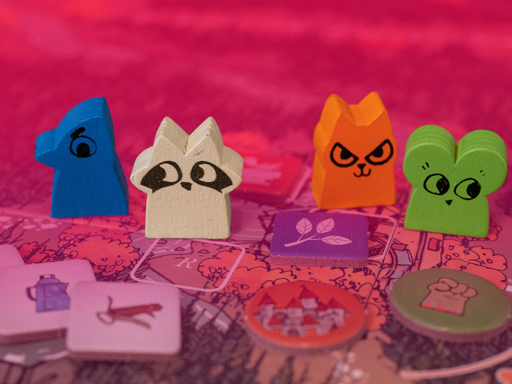

Say you and I are flipping a coin, heads you win tails I win. This is a symmetric game. If you and I are playing a 2d fighting game, you as a big robot, me as a half-tiger person, each with different moves available to us, then clearly the game is asymmetric. 

{:class="img-responsive"}
*Tekken 7, PS4, XboxOne, PC, Arcade. 2015.*

Many traditional board games are symmetric, consider Chess or Draughts. All players have access to the same materials, can find themselves in the same state and have the same actions available to them from those states. A symmetric game where players act simultaneously is balanced by default. With a turn-based game you have to overcome **first-move bias**. 

### Chess, board game. *~500 AD, Hán Xin*

Give me a moment to talk about Chess. In Chess, White goes first and, according to many professional players and Chess theorists, has an advantage. Indeed White wins more often than Black historically (the records available date back to 1851). Thrillingly, a large proportion of Chess matches at the highest level end in draws, but I'm a football fan, so I suppose I'm desensitised to that. White wins roughly 40% of games, whereas Black wins about 30%. 

But not all players believe White's advantage to be so strong. A nineteenth century German Chess article described the phonetically beautiful concept of *"Zugzwang"*, the compulsion to move. The use of the term has changed over the last century, but is often used to describe a position from which neither player benefits from making a move, therefore whoevers turn it is, is at a disadvantage. Scottish Chess player and Philosopher (naturally) Jonathan Rowson introduced the term *"Zugzwang Lite"* to describe a situation where both players want to react to their opponents move and in this instance White's *extra* move is infact a burden. 

So maybe first-move advantage isn't such a problem in Chess? Of course the whole thing is easily solved by playing a series of games and swapping sides, or flipping a coin to decide who plays what. Considered before the coin flip, the game is symmetric.

~~

Tekken isn't asymmetric of course, I chose it as an example earlier so I could use pictures of King (the Tiger-headed man on the right of the image above). Matches in Tekken are preceeded by **Character Selection**. Here players choose one, or several members from the cast of available fighters, often choosing distinct material from a shared pool. So even if King is more likely to beat Jack (the robot-looking man on the left), the game is balanced because either player could choose them. So that's it then? Symmetric games are balanced, asymmetric games can include material selection beforehand from a shared pool to become symmetric, therefore all games can be balanced. Job Done. Let's all just pack up and leave.

Except that's a view that is empathetic to the players, but not the game material itself. What about poor old Jack doomed to lose to King more often than not? Letting down whatever poor idiot had the misfortune of choosing him? No I want to ensure about balance **between material**.

Here's a stupid example. A two-player game where one player wins by flipping a coin ten times and rolling ten heads, should they fail their opponent wins, is a terrible game. But if the player who must attempt the flips is decided by a coin flip too, then the odds of either player winning are 50:50, the game is symmetric. Clearly it isn't balanced.

I'll write about how we can balance between material another time, for now I want to talk about some games which use their asymetry as a feature, and the attempts to balance the game regardless.

### Diplomacy, board game. *1959*, Allan Calhamer

Diplomacy takes seven players (don't be fooled into trying to play with any fewer, it's much worse) and sends them back to Europe in 1901. There is [a great bit of writing](http://www.diplomacy-archive.com/resources/calhamer/invention.htm) by Calhamer himself on his motivations for developing the game and some of his inspirations. How it came from a 1945 article on postwar planning suggesting several *great power* of equivalent strength would be a good way of guarenteeing peace. Having played Diplomacy several times, I'm not so sure.

{:class="img-responsive center"}
*Diplomacy, board game*

Players control one of Great Britain, France, Germany, Italy, Austria, Russia or Turkey and push out to gobble up territory. One thing that stands out from the image alone is just how much of the board Russia takes up. This speaks to one of the common reasons assymetry arises in game design -- the game is representing some real-world artifact. In the same vein, Russia begins with 4 *capitals* and 4 units, where-as all other players have only 3. An unfair advantage surely. Except, it isn't. In tournament play Russia is no more dominant than any other nation. The general sentiment is that Russia starts at a disadvantage as others look at their extra unit and larger physical space on the map (something which has no bearing on the game) and judge them to be the early leaders, so are often ganged up on. The asymmetry in Diplomacy both fits with the game's setting and provides impetus to the early game which can sometimes be frigid and slow.

*"Everyone will give the same warning about Diplomacy, that it can lose you friends. Whilst that may be true, it's hard to argue that it isn't worth it."*

### Rainbow Six: Siege, PS4, XboxOne, PC. 2015, Ubisoft Montreal.

Two teams of five shoot it out over several objective-based rounds, taking it in turns to play as Defenders, boarding up doorways, reinforcing walls and protecting the all important *Biohazard Container*, and Attackers sending in drones to locate the objective and smashing through defenses to secure it. Each player plays a different *operator*, with different operators available to attackers and defenders. Each operator has unique abilities and different weapons available to them, specialising in different roles. Siege is not the first game to have two separate pools for character selection, but it is done particularly well and I've played it a lot so I'm comfortable talking about it.

One of the best things about Siege, to my mind, is the openness with which Ubisoft share their analytics, because it means I can use their data in all of my slides. They appear to base a lot of their insights into character viability on pick-rate, win-rate. 

{:class="img-responsive"}
*Here's Ubisoft struggling with the axis. Always nice to know the bigger children struggle with the simple stuff too*

For the uninitiated, the image above shows us one half of the available operators in the game, the Defenders. The x-axis shows how often they are picked, with a line denoting what the expected value would be if they were picked evenly. The y-axis shows how often they win when picked, specifically how their presence affects the teams likelihood of winning. One would expect a simple pattern of f(x) = y, the more effective an operator is, the more often they are chosen. But that doesn't account for the nuance of the characters themselves. In Siege one of the consistently best performing Attackers is Finka, a big Russian support character who helps her team by using nanobots to heal them, recover them when they've been downed and reduce their recoil. However, Finka is rarely picked, she has been in the top-left quadrant labeled *underpicked, too strong* in most recent seasons. What on earth is going on? The answer, I suspect, is that she isn't as exciting to play. Her role is to make her allies excel, not to excel herself. So is she unbalanced? If she was, surely she would be being exploited by the community? These are the kind of game balancing questions I love. 

{:class="img-responsive"}
*Finka: "It's alright, I don't want to be picked anyway"*

### Root, board game. 2018, Leder Games.

Root is an undeniably beautiful 4-player board game which transposes a unique woodland theme onto a more classical war game. Players play as one of four groups each essentially playing their own game: 'The Marquise de Cat', cats who begin with control over much of the board; 'The Eyrie Dynasties', birds who start with minimal presence; 'The Woodland Alliance', rebels who seek to overthrow the cats, or; 'The vagabond', a lone protagonist who can join any side in completing their own secret quest. All players have different starting positions, different rules and different ways to get victory points. These systems designed around asymmetry are ambitious and, when they work, offer a thrilling experience full of satisfying "You can do what?!" moments that some players will love. Some.

The issue with systems like this is they are inevitably complex. In what is at its core a race to acquire victory points, players who don't know the intricacies of playing as all factions can't make informed decisions. It should be noted the Riverfolk expansion increases the player and faction size to 6. The other concern is how on earth you balance these games. Root is well thought of, at the time of writing it is the 32nd game of all time according to boardgamegeek.com. I quite like it too, but for the theme and the unique experience rather than the gameplay itself. 

{:class="img-responsive"}
*Root, a work in progress*

Root is one of a few board games which have been balanced after their release. This is clearly a bold move by the developers and one that sparked no small amount of controversy. Here is an excert from the developer's FAQ *"When we play tested in the office we got to witness hundreds of games. Now that we are witnessing thousands of games we noticed certain patterns emerging and made some balance fixes."* In a smaller setting patterns of play can emerge and a game can appear balanced when it isn't. Anticipating how players will play your games is hugely difficult. You can now buy a relatively cheap 'upgrade kit' for early editions of the game which don't feature the balance changes. 

Given I write a blog called balance.games, you can assume I believe game balance to be fairly important. But I am not a professional game developer, so what do I know. [Cole Wehrle](https://boardgamegeek.com/boardgamedesigner/35585/cole-wehrle) is, indeed he developed Root. Here is his take on Root's balance: 
> *Speaking frankly, the core design of Root was not built for that kind of competitive balance. As far as I was concerned, the game lives in the imbalance between player positions. When one faction loses an important battle, that event has consequences that ripple through all of the player positions. Things can get downright weird. Which is good, because history is weird and I wanted players to feel that kind of discomfort.*

And this is a difficult concept to deal with at the end of the first post on a blog about balancing games. **Sometimes imbalance is a game feature.** Root is a good game. It also happens to be an imbalanced game. 

