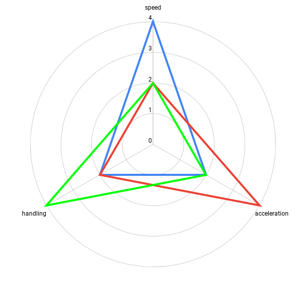

Orthogonal Unit Differentiation or "making sure each piece of game material is unique to all others in some way" is tricky to get right. Without it you run the risk of **strictly dominanted** material, that is some material *x* which is worse in every way to some other material *y* . Here's an illustrative example, let's design **Very Good Racing Game** as a simple car-racing game. Let's limit the game material to **cars** and **tracks**. Tracks are represented by simple 2d designs, **cars** have *attributes* which define them further, let's use **top speed**, **acceleration** and **handling**, each with a value from 1 to 5. Here are some initial designs.

{:class="img-responsive right"}
{:class="img-responsive left"}
{:class="img-responsive center"}
*You may call them terrible drawings, I call it rapid prototyping*

Now we have 3 cars each suited to different types of a track. Green is best for sharp turns, Red is best on long straights and Blue is best for shallow bends or short straights. If a track is designed with all 3 in mind then each will excel at different times, done correctly this will *enable the player to make impactful decisions* -- something all development should strive for.

*A simple track*

In this simple example with only 3 attributes each car can be easily visualised using radars, this helps us to identify the real villain of the piece, **strictly dominated material**. Strictly dominated material would be any material that is entirely contained within another in a radar plot.

*Basic radar plot*

One easy way to *balance* the cars would be to set a total value for all attributes, say 8, and have one car for every possible combination with each attribute having atleast 1. This gives 18 unique combinations of attributes summing to 8