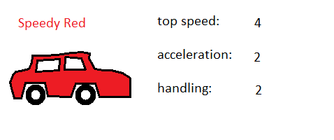
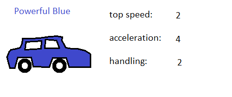

Orthogonal Unit Differentiation or "making sure each piece of game material is unique to all others in some way" is tricky to get right. Without it you run the risk of **strictly dominanted** material, that is some material *x* which is worse in every way to some other material *y* . Here's an illustrative example, let's design **Very Good Racing Game** as a simple car-racing game. Let's limit the game material to **cars** and **tracks**. Tracks are represented by simple 2d designs, **cars** have *attributes* which define them further, let's use **top speed**, **acceleration** and **handling**, each with a value from 1 to 5. Here are some initial designs.

{:class="img-responsive left"}
{:class="img-responsive center"}
{:class="img-responsive right"}

*Some very good cars*